
 
    

# Table of contents

- [Description](#Description)
- [Screenshots](#Screenshots)
- [Technologies](#Technologies)
- [Contributers](#Contributers)

# Description

Jobify is a web portal designed to make it easier for job seekers to browse for jobs matching their skills.

# 📷 Screenshots

## 🔑 User Management

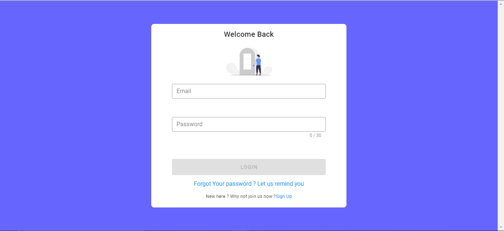

## 🙍‍♂️ Applicant

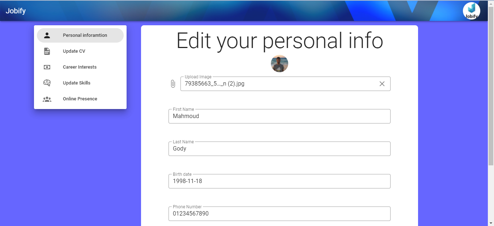
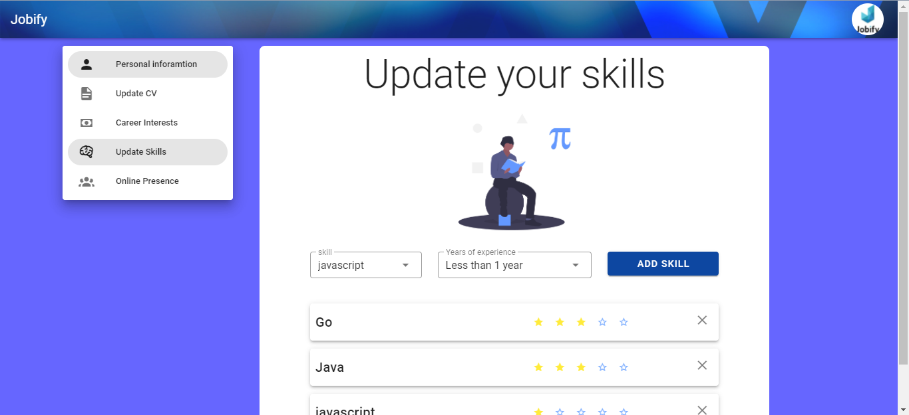
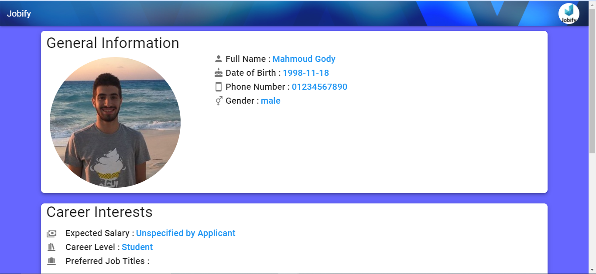
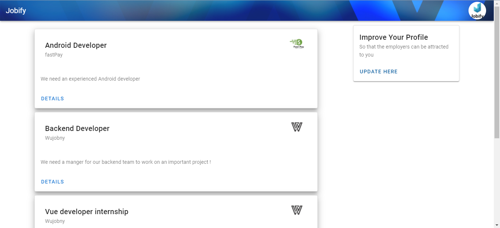
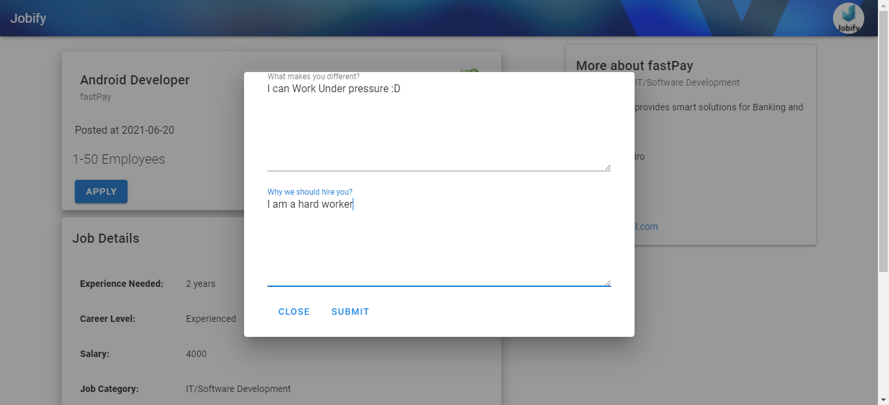
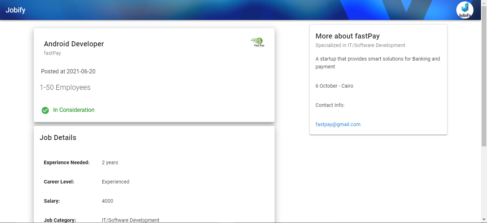

## 🏢 Recruiter

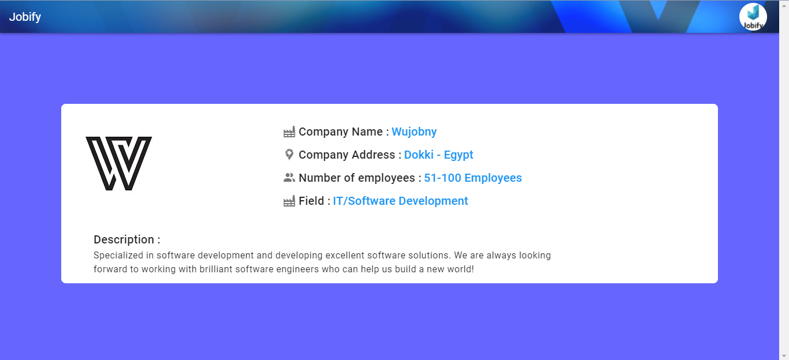
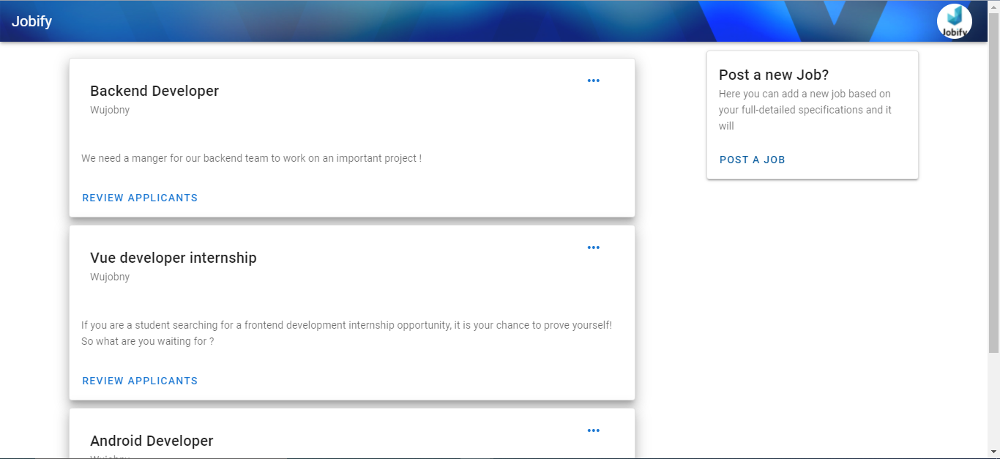
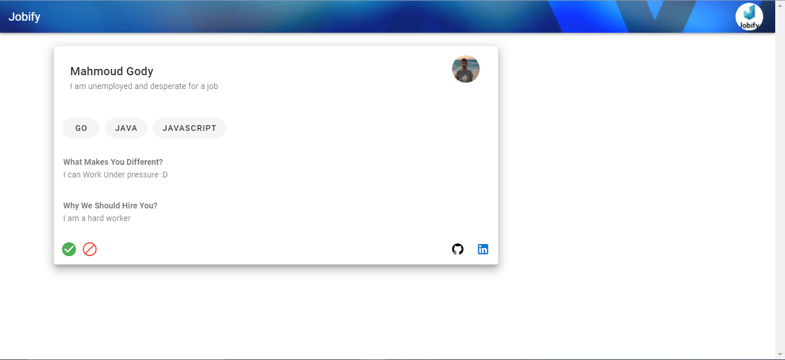

## 🔐 Admin panel

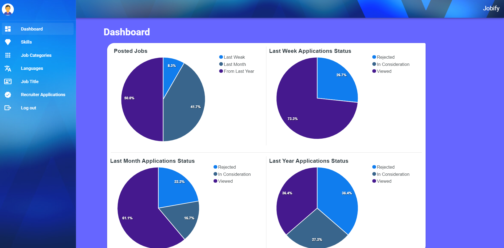
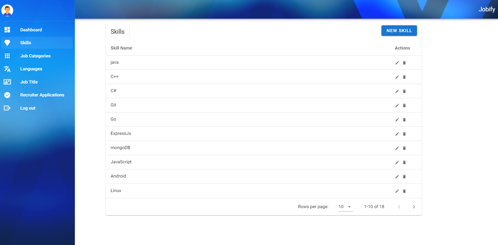
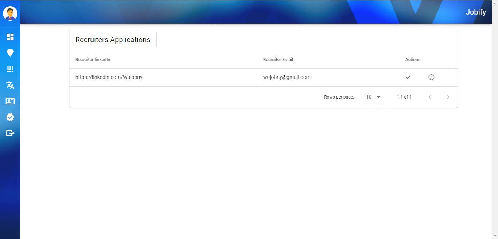

# Technologies

## Frontend

- Vue js
- Vuex
- Vue Router
- Vuetify

## Backend

- ExpressJS
- MongoDB

# Contributers

- [Hossam Alaa](https://github.com/hossamalaa69)
- [Muhammed Ahmad Hesham](https://github.com/Etshawy1)
- [Muhammed Alaa](https://github.com/MuhammeedAlaa)
- [Mahmoud Gody](https://github.com/Moodrammer)
